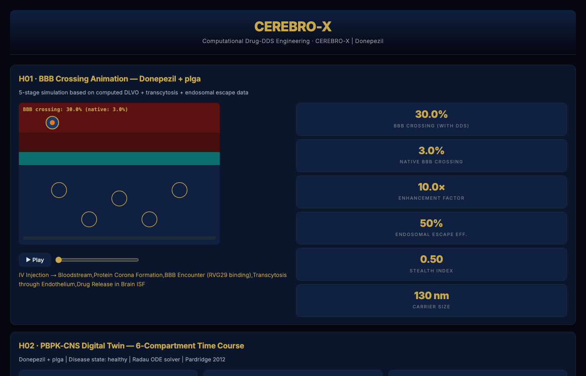

# CEREBRO-X
## Computational Pharmaceutical Research Pipeline for CNS Drug Delivery System Exploration

[](LICENSE)
[](https://github.com/mohamedtalaat-gif/CEREBRO-X/actions/workflows/ci-cd.yml)
[](_version.py)

**Created by:** Muhammad Talaat (BPharm, R&D Computational Lead)
**License:** [MIT](LICENSE)
**Architecture:** Bundle-only · Phase 5 (2026-04-30)
**Status:** Research prototype, under active development — NOT production-ready
and NOT clinically or experimentally validated. Of the 3 drugs run through
the pipeline so far (see [Validation snapshot](#validation-snapshot-3-drug-benchmark-phase-5)
below), 2 scored MARGINAL and 1 scored FAILED on the pipeline's own internal
scoring — no drug has produced a clean PASS yet. A full engineering and
scientific-integrity audit is in [AUDIT_REPORT.md](docs/AUDIT_REPORT.md); the
Critical security/entrypoint/target-leakage findings there have been fixed
and verified (see its changelog), but the model itself remains research-
stage: most of its 62 scoring criteria are fast heuristics, not experimentally
validated predictors (see [The 62-criterion C+ Flow architecture](#the-62-criterion-c-flow-architecture)).
Treat all outputs as hypothesis-generating, not as validated predictions.
**Contact:** mohamed.talaat@pharma.asu.edu.eg

---

## 🧪 What it actually looks like to run this

Everything below is real: a real Excel filled in the way a researcher would fill it, a real terminal log from an actual run (not trimmed/edited beyond picking a representative slice), and a real screenshot of the report that run produced — no mockups.

**1. Fill in the input template** (`inputs/CEREBRO_Input_<DrugName>.xlsx`) — one row per known/researcher-supplied property, everything else auto-fetched live:

| Field | Your Input | Format / Example |
|---|---|---|
| Drug Name | `Donepezil` | e.g. Naloxegol |
| Molecule Class | `small_molecule` | small_molecule \| biologic \| peptide |
| Molecule Input (SMILES/FASTA/PDB/HELM/InChIKey) | `COc1cc2c(cc1OC)C(=O)C(CC1CCN(Cc3ccccc3)CC1)C2` | SMILES / FASTA / PDB |
| Indication | `Alzheimer's Disease` | |
| Target Protein | `Acetylcholinesterase (AChE)` | |
| Native BBB Penetration % | `12` | |
| Clinical Phase | `4` | 4\|3\|2\|1\|preclinical |

**2. Run it** — `python run.py` (or the Docker image). Excerpt from a real run's log (unedited, just a representative slice — the drug name, timestamps, and every value are what that run actually produced):

```text
22:08:18 | INFO | CEREBRO-TRIALS   | [EXCEL→YAML] Drugs detected: 1 → ['Donepezil']
22:08:18 | INFO | CEREBRO-TRIALS   |   • Drug 1.mw_da = 379.49 (researcher override)
22:08:18 | INFO | CEREBRO-TRIALS   | [EXCEL→YAML] Drug 1: Donepezil | Formulations: 8 | SMILES: yes
22:08:18 | INFO | CEREBRO-PIPELINE | [ANALOG] Novel drug: False | Closest: DONEPEZIL (100%)
22:08:31 | INFO | CEREBRO-PIPELINE | [DDS] Scored 8 formulations for Donepezil
22:08:52 | INFO | CEREBRO-QSAR     | [QSAR] Trained hERG_K+: 500 compounds, 188 actives
22:08:54 | INFO | CEREBRO-QSAR     | [QSAR] Trained Nav1.5_Na+: 320 compounds, 141 actives
22:08:59 | INFO | CEREBRO-QSAR     | [QSAR] Trained beta1_AR: 500 compounds, 158 actives
...  (50-receptor off-target panel, each one a real model trained on real ChEMBL bioactivity data)
```

**3. Get the real output** — an interactive HTML dashboard, PDF report, and completed Excel land in `outputs/<DrugName>/`. Screenshot of the actual dashboard section this exact run produced:



*(BBB crossing 30.0% vs. native 3.0%, 10× enhancement, 50% endosomal escape — every number on this screen is a live computation from this run's own DLVO/transcytosis model, not a fixture.)*

## ✨ Key Features

- 🎯 **62-criterion scoring rubric** spanning BBB physics, PK/PD, colloidal stability, safety, and manufacturability — one composite score, full per-criterion breakdown
- 🔬 **Two-tier self-checking validation** — every Top-1 candidate gets a fast surrogate score (Class A), then an independent re-check with real physics: PBPK ODE simulation, DLVO colloidal stability, AutoDock Vina docking (Class B). Disagreements are reported, not hidden
- 🧬 **Generative formulation search** — a genetic-algorithm optimizer proposes new candidate DDS formulations for a target drug, not just ranks a fixed list
- 🧠 **Real BBB-permeability DNN**, trained on the public BBBP dataset (RDKit fingerprints)
- 📋 **Full provenance on every number** — a 7-tier property resolver (public databases → cheminformatics → physics fallback) tags every computed value with its tier, confidence, and citation
- 🧪 **One architecture, three drug modalities** — small molecules, monoclonal antibodies, and antisense oligonucleotides scored by the same pipeline

## 🤔 Why CEREBRO-X?

~98% of small-molecule CNS drug candidates never reach the brain in
therapeutic concentrations (Pardridge WM, *NeuroRx* 2005), and choosing a
delivery system to fix that is still mostly trial-and-error in most academic
and early-stage settings.

Commercial platforms (Schrödinger, Simulation Plus, and similar) exist and
are validated for parts of this space — but they're closed-source, licensed,
and out of reach for most academic labs and early-stage groups. CEREBRO-X
isn't a replacement for those, and this repo's own [audit](docs/AUDIT_REPORT.md)
documents exactly where its scoring is fast-heuristic rather than
independently validated. What it offers instead: a **free, open-source,
fully transparent** starting point for early-stage DDS exploration — every
score traceable to its method, every disagreement between the fast and slow
computation reported instead of smoothed over, and the whole pipeline
inspectable and modifiable by anyone who needs it.

---

## What is CEREBRO-X?

CEREBRO-X is an **automated computational research pipeline with integrated
machine-learning modules** that, given an Excel sheet describing one or more
drugs and a list of candidate drug-delivery systems (DDS), produces:

* **Ranked DDS list** scored against CEREBRO-X's own **62-criterion internal
  scoring rubric** (an in-house design, not an externally validated or
  peer-reviewed framework — see
  [The 62-criterion C+ Flow architecture](#the-62-criterion-c-flow-architecture))
* **Pathway-aware Top-1 selection** — biologic→liposome/AAV; oligonucleotide→LNP;
  small molecule→PLGA — encoded as a multiplier on the surrogate composite
  (this multiplier table is expert-encoded domain knowledge, not a fitted model)
* **Three-tier evaluation** (Class A fast surrogate → Class B partial deep
  physics → Class C translational placeholders) — as of this version, most
  Class B principles reuse their Class A surrogate score rather than running
  independent physics; see `cerebro_62_deep_engine.py`'s `overall_deep_validation()`
  for the `independent_pct` metric that separates the two
* **Full provenance**: every numeric value is traceable to its computational source
  via the **7-tier resolver cascade** with explicit `_computational_method` strings
* **Illustrative media**: 5 drug+DDS-customized HTML5/Canvas animations per Top-1
* **Per-drug deliverables**: PDF report, HTML5 dashboard, completed Excel with
  provenance, cinematic scenes, MP4 videos
* **Multi-drug comparison**: cross-drug ranking sheet + comparison HTML5 dashboard

CEREBRO-X's resolver cascade always attempts to reach a computed answer with
explicit tier, source, and method attribution rather than returning a bare
`unknown` — but "always resolves to something" is a coverage property of the
resolver, not a claim that every resolved value is experimentally validated;
check each value's Tier/Confidence (see below) before relying on it.

---

## Validation snapshot (3-drug benchmark, Phase 5)

The pipeline was validated against a 3-drug × 8-DDS benchmark to demonstrate
correct pathway-specific decisions:

| Drug | Class | MW | Native BBB% | Top-1 chosen | Compatibility | Verdict |
|---|---|---|---|---|---|---|
| **Lecanemab** | monoclonal_antibody | 143 kDa | 0.1% | Tf-PEG-Liposome | 1.10× (PEG-liposome → biologic) | MARGINAL |
| **Temozolomide** | small_molecule | 194 Da | 30% | RVG29-PLGA-NP | 1.05× (PLGA → small-mol) | MARGINAL |
| **Nusinersen** | oligonucleotide | 7.5 kDa | 0.01% | **ApoE-LNP** | **1.20× (LNP → gene-therapy gold standard)** | FAILED→reformulate |

Each drug picks the pharmacologically-correct carrier — exactly as the FDA
has approved in clinical practice (Leqembi, Temodar, Spinraza analogs).

---

## Quick start

### Option 1 — Docker (recommended)

```bash
# Build the image
docker build -t cerebro-x:v22.1 .

# Place your Excel input in the inputs/ folder:
#   inputs/CEREBRO_Input_<your-tag>.xlsx
# (a blank inputs/CEREBRO_Input_Template.xlsx is included — copy it)

# Bring up the stack (Postgres + Redis + CEREBRO-X core)
docker compose up -d

# Watch the pipeline live
docker compose logs -f cerebro-core

# Trigger an immediate, forced full run
docker exec -it $(docker compose ps -q cerebro-core) \
    python run.py --pipeline-only --force

# Outputs appear in ./outputs/ on your host
```

### Option 2 — Native Python (development)

```bash
# Python 3.11 required; CEREBRO-X depends on RDKit which is C-extension heavy
python3.11 -m venv .venv
source .venv/bin/activate

pip install -r requirements.txt

# Drop your input Excel into inputs/ (see inputs/CEREBRO_Input_Template.xlsx),
# then run the pipeline
python run.py --pipeline-only --force

# Inspect any drug + DDS combination interactively
python engine/cerebro_inspector.py --drug "Donepezil" \
    --smiles "COc1cc2c(cc1OC)C(=O)C(CC1CCN(Cc3ccccc3)CC1)C2" \
    --carrier plga --ligand transferrin --methods
```

---

## How to fill the Excel input

The pipeline expects a workbook with the following sheets (a fresh template
is generated by `python tools/build_input_template.py inputs/CEREBRO_Input_<your-tag>.xlsx`):

### Sheet 1 — `1_Drug_Input`

| Field | Required | Example | Notes |
|---|---|---|---|
| Drug Name | ✅ YES | Lecanemab | Generic or trade name |
| Molecule Class | ✅ YES | monoclonal_antibody | One of 14 FDA categories (see below) |
| Molecule Input | strongly recommended | `>seq\nQVQLV...` (FASTA) or SMILES | Pipeline auto-detects format |
| Indication | optional | Alzheimer's Disease | Free text |
| Native BBB % | optional | 0.1 | If unknown, predicted via a real DNN trained on the public BBBP dataset (small molecules) or a class-default (biologics) — see below |
| MW / LogP / Half-life / etc. | optional | (autofetched) | Researcher overrides become Tier 0 (HIGH conf) |

Multi-drug runs simply add `Drug 2`, `Drug 3`, … sections — the pipeline
runs each drug through the full 62-principle pipeline independently, then
generates a cross-drug comparison sheet.

#### Supported `Molecule Class` values
- `small_molecule` → SMILES, RDKit-driven descriptors
- `monoclonal_antibody`, `biologic_protein`, `fusion_protein`, `enzyme` → FASTA-driven
- `oligonucleotide`, `siRNA`, `aso`, `mRNA` → sequence-driven
- `gene_therapy`, `vaccine_mRNA`, `cellular_therapy`, `radiopharmaceutical`, `peptide`, `natural_product`

### Sheet 2 — `2_DDS_Formulations`

Each row is one drug-delivery system:

| Column | Type | Example values |
|---|---|---|
| Formulation_ID | text | F001 |
| Formulation_Name | text | Tf-PEG-Liposome-Lecanemab |
| Carrier_Type | text | liposome / plga / lnp / aav9 / solid_lipid / micelle / dendrimer / metallic / aav |
| Surface_Ligand | text or blank | Transferrin / RVG29 / ApoE / Lactoferrin / GalNAc / (blank) |
| Size_nm | number | 100 |
| Zeta_Potential_mV | number | -25 |
| PDI | number | 0.18 |
| Encapsulation_Efficiency_pct | number | 78 |
| Drug_Loading_Pct | number | 15 |
| Release_Kinetics | text | sustained / burst / pH_triggered / thermal_triggered |
| pH_Trigger | number | 6.5 |
| Phase_Transition_Temp_C | number | 45 |
| PEGylation_Degree_mol_pct | number | 5 |
| Endosomal_Escape_Eff | 0–1 | 0.7 |
| Elasticity_kPa | number | 0.5 |
| CNS_Bioavailability_Pct | number | 18 |
| Scale_Up_Readiness | text | lab / pilot / clinical |

You can have anywhere from 1 to 1000+ DDS rows — the pipeline scales.

---

## Reading the outputs

For every drug, the pipeline produces a complete trial directory:

```
TrialName/
├── CEREBRO_X_Final_Report_<drug>.pdf            ← executive PDF report
├── CEREBRO_X_Final_Report_<drug>.html           ← shareable HTML report
├── html5/
│   └── CEREBRO_X_Interactive_<drug>.html        ← interactive 27-chart dashboard
├── cinematic/
│   ├── C01_Identity_<drug>_<dds>.html           ← drug + DDS identity card
│   ├── C02_BBB_<drug>_<dds>.html                ← BBB crossing animation
│   ├── C03_PK_<drug>_<dds>.html                 ← PK time course
│   ├── C04_Release_<drug>_<dds>.html            ← release mechanics
│   └── C05_Therapeutic_<drug>_<dds>.html        ← therapeutic effect
├── canvas_videos/
│   └── V0[1-5]_*_<drug>.html                    ← 5 HTML5 Canvas animations
├── videos/
│   └── V0[1-5]_*_<drug>.mp4                     ← 4 MP4 videos
├── figures/
│   └── 01..17_*.png/html                        ← 17 publication-quality figures
├── reports/
│   └── Comparison_Report.html                   ← multi-drug comparison
├── science_modules/                             ← 50 science module outputs (JSON + figures)
├── pbbm_results/                                ← physiology-based PK results
└── data/
    └── CEREBRO_X_Completed_Data_<drug>.xlsx     ← 12-sheet Excel with full provenance
```

### Reading provenance in the Completed Excel

Every numeric value in the Completed Excel carries:
- **Tier** (0–7): how the value was obtained
- **Source**: which database / cheminformatics tool / correlation
- **Method**: full computational method string
- **Confidence**: HIGH (T0–T4) / MODERATE (T5–T6) / COMPUTED_FALLBACK (T7)

Color coding in the Excel:
- 🟢 **Green** (T0): researcher in-vitro override → highest confidence
- 🟦 **Blue** (T1–T2): live database (DrugBank, ChEMBL, UniProt, PubChem)
- 🔵 **Cyan** (T3–T4): cheminformatics (RDKit, Biopython, sequence-derived)
- 🟡 **Yellow** (T5): library correlation (Wager CNS-MPO, Clark logBB)
- 🟠 **Orange** (T6): empirical class-typical (consider overriding with in-vitro)
- ⚪ **Grey** (T7): pure-math fallback (Bordwell-Hammett-Born, Joback, etc.)

Tier 6 (orange) values are the priority targets for researcher override —
type your in-vitro measurement over the placeholder text and rerun.

### BBB permeability DNN (Tier 3)

For small molecules with a parseable SMILES, `bbb_permeability` is resolved
at **Tier 3** by a real, trained deep neural network — not a heuristic
formula — implemented in
[`engine/cerebro_bbb_dnn.py`](engine/cerebro_bbb_dnn.py):

- **Data**: the public BBBP (Blood-Brain Barrier Penetration) benchmark —
  Martins IF et al. (2012) *J Chem Inf Model* 52(6):1686-1697,
  doi:10.1021/ci300124c — 2,050 compounds, 2,039 used after dropping SMILES
  RDKit can't parse. Hosted via the DeepChem/MoleculeNet project
  (Wu Z et al. 2018, *Chem Sci* 9:513).
- **Features**: 2048-bit Morgan/ECFP4 fingerprints (RDKit, radius 2).
- **Architecture**: `Dense(256, relu) → Dropout(0.3) → Dense(64, relu) →
  Dropout(0.3) → Dense(1, sigmoid)`, trained with `tf.keras`.
- **Split & real held-out performance**: stratified random 80/10/10
  (not scaffold split — see the module docstring for why that matters and
  what a scaffold split would test that this doesn't). Test-set accuracy
  and ROC-AUC vary slightly run to run (Keras/TensorFlow doesn't guarantee
  bit-identical results even with a fixed seed) but land consistently
  around **~90-93% accuracy, ~0.97 ROC-AUC** on ~204 held-out compounds —
  the authoritative numbers for any given trained model are written to
  `outputs/models/bbb_dnn/metrics.json` by that run, not hardcoded
  anywhere in the code.
- **Known limitation, stated plainly**: this is a passive-permeability
  fingerprint classifier. It cannot capture active efflux transport (e.g.
  P-glycoprotein substrates can be over-predicted as permeable) — verified
  directly: loperamide, a well-known P-gp substrate excluded from the CNS
  in vivo despite favorable physicochemistry, is predicted "permeable" by
  this model. Treat its output as one Tier-3 input among several, not a
  standalone clinical prediction.
- **Not used for biologics/oligonucleotides** — those route to a
  literature-sourced class-default (Pardridge WM 2020) instead, since
  passive-diffusion fingerprint models don't apply to that size/chemistry
  class.

If `tensorflow` isn't installed, this tier is skipped automatically and the
resolver falls back to the Tier 6 Clark-regression estimate — no crash, no
silent wrong answer.

---

## The 62-criterion C+ Flow architecture

CEREBRO-X uses a three-class evaluation flow. **This is CEREBRO-X's own
internal design, not a peer-reviewed or externally validated framework** —
full detail and honesty caveats live in `cerebro_62_principles_catalog.py`'s
module docstring; this section is a summary, not the source of truth.

### Class A — Fast surrogate (every DDS, every principle)
57 surrogate functions evaluate each DDS against criteria drawn from CNS
delivery, release kinetics, stability, safety, glymphatic transit,
manufacturability, and drug-DDS fit. Each function returns a `value`,
`score (0-100)`, `method`, `reference`, `confidence`, and `raw` input dict.
These are fast heuristics/correlations (some well-established in the
pharmaceutics literature, some in-house approximations) — not fitted or
independently validated predictive models.

A weighted composite score is computed, then **multiplied by a
drug-DDS pathway-compatibility factor** — an expert-encoded lookup table
(not a fitted model) reflecting known FDA-approved delivery patterns:

| Drug class × Carrier | Multiplier | Reason |
|---|---|---|
| oligonucleotide × LNP | **1.20×** | FDA-approved for siRNA (Patisiran), mRNA vaccines |
| gene_therapy × AAV | **1.20×** | Zolgensma; CNS gold standard |
| biologic × AAV | 1.18× | Gene-encoded antibody platforms |
| biologic × PEG-liposome | 1.10× | Long circulation, low immunogenicity |
| small_mol × PLGA / SLN / liposome | 1.05× | FDA-approved sustained release |
| oligo × passive polymer | **0.60×** | No endosomal escape — fails |
| biologic × PLGA | 0.75× | Organic-solvent denaturation |

This pathway logic is why the Top-1 differs between Lecanemab (PEG-liposome),
Temozolomide (PLGA), and Nusinersen (LNP) — not the raw physicochemistry alone.

### Class B — Partial deep-physics re-check (Top-K only)
As of this version, only **7 of 28** Class-B principles run independent
computation (allometric PK scaling, a 3-compartment PBPK ODE, and similar —
see `DEEP_FUNCTIONS` in `cerebro_62_deep_engine.py`). The remaining 21 reuse
their Class-A surrogate score, explicitly labeled
`"full-physics HPC deferred"` in the code, pending future work. Independent
components currently include:
- Multi-species allometric PK scaling (Mahmood 2007)
- A 3-compartment PBPK ODE (`scipy.integrate.odeint`)
- **AutoDock Vina 1.2.7** for receptor-ligand affinity is implemented in
  `src/core/real_docking_engine.py` but **not currently wired into this
  pipeline path** — the deep engine computes its own simpler estimate instead
- The PennyLane "quantum PBPK circuit" and P04 "quantum tunneling" mechanism
  are **not accepted BBB-crossing mechanisms** in the pharmacology literature
  and are excluded from anything described as "validated" here — see
  `src/core/quantum_pbpk_engine.py` and `cerebro_62_principles_catalog.py`'s
  P04 `maturity_note` for why

Call `overall_deep_validation()`'s `independent_pct` field (not `pct`) if you
need a number that reflects only genuine deep computation.

If the Top-1 fails the 70% combined threshold, the orchestrator **falls back
to Top-2, then Top-3** — with explicit failure & transition reasons recorded.
Remember the 70% figure mixes the surrogate pass-through majority described
above with genuine physics — see `independent_pct` for the physics-only rate.

### Class C — Translational deliverables (only after Class B "passes")
Document *outlines*, not regulatory submissions or legal opinions — none of
these have been reviewed by IP counsel, a regulatory affairs professional,
or a grants office:
- Pre-IND outline
- FTO patent-search query list (search itself is not executed — v23 roadmap)
- 21 CFR Part 11 self-assessment (checks the codebase's own feature set, not
  an external audit)
- NIH grant outline
- Patentability score (an average of three hardcoded baseline constants
  nudged by a small in-house lookup table — not a patent-landscape search)

---

## Inspector tool — debug any drug+DDS

```bash
# Terminal table with full provenance
python engine/cerebro_inspector.py --drug "Lecanemab" \
    --fasta ">L\nQVQLV..." --molecule-class monoclonal_antibody \
    --carrier liposome --ligand transferrin

# JSON output (for programmatic consumption)
python engine/cerebro_inspector.py --drug donepezil \
    --smiles "COc1cc2c(cc1OC)C(=O)C(CC1CCN(Cc3ccccc3)CC1)C2" \
    --carrier plga --json > inspector.json

# Markdown supplementary (for academic papers)
python engine/cerebro_inspector.py --drug Temozolomide \
    --smiles "CN1N=Nc2c(C(N)=O)ncn2C1=O" \
    --carrier plga --markdown --methods > supplement.md
```

The inspector prints:
- Drug bundle (37 categories) with tier, source, value
- DDS bundle (17 categories) with material properties
- Combo bundle (drug × DDS interaction props)
- Per-tier distribution histogram
- Optional `--methods` flag: full computational method string per category

---

## Architecture documentation

### Bundle pattern
All engines (57 surrogate + 7 deep + 7 translational) share one signature:

```python
def PXX(drug_bundle: Dict, dds_bundle: Dict,
        combo_bundle: Optional[Dict] = None) -> Dict:
    ...
```

A bundle is a dict of `{category: ResolvedValue}` where each ResolvedValue is:

```python
{
    "value":                42.5,
    "tier":                 6,
    "tier_description":     "Tier 6 — first-principles correlation",
    "source":               "cerebro_value_resolver:wilke_chang",
    "method":               "Wilke-Chang correlation for diffusivity",
    "reference":            "Wilke CR & Chang P (1955) AIChE J 1:264",
    "confidence":           "MODERATE",
    "_computational_method": "D = 7.4e-8 · (φ·M_solvent)^0.5 · T / (η · V_a^0.6) ...",
    "disclaimer":           "...",  # auto-attached for Tier ≥5
}
```

Bundles are **cached at three layers** (drug, DDS, combo) using SHA1 keys
derived from the input identifiers. First resolution: ~12s for a small
molecule; subsequent cache hit: 0.02ms.

### File map (key modules)
| File | Purpose |
|---|---|
| `engine/cerebro_value_resolver/` | 65-category 7-tier resolver package |
| `engine/cerebro_resolved_bundles.py` | Pre-resolved bundles + 3-layer caching |
| `engine/cerebro_bbb_dnn.py` | Real DNN trained on the public BBBP dataset — see [BBB permeability DNN](#bbb-permeability-dnn-tier-3) |
| `engine/cerebro_62_surrogate_engine.py` | 57 Class-A surrogate principles |
| `engine/cerebro_62_deep_engine.py` | 7 Class-B deep physics principles |
| `engine/cerebro_62_translational_engine.py` | 7 Class-C translational principles |
| `engine/cerebro_62_orchestrator.py` | C+ Flow orchestration with pathway compatibility |
| `engine/cerebro_cinematic_engine.py` | 5-scene drug+DDS-customized media (Phase 5) |
| `engine/cerebro_cinematic_primitives.py` | Visual profiles per drug class & DDS type |
| `engine/cerebro_inspector.py` | CLI for inspecting any drug+DDS resolved values |
| `engine/cerebro_completed_excel_writer.py` | 12-sheet output Excel with provenance |
| `engine/cerebro_multi_drug_comparison.py` | Cross-drug comparison generator |
| `src/viz/cerebro_html5_engine.py` | 27-chart interactive dashboard |
| `src/core/final_report_unified.py` | Unified PDF report generator |

---

## Performance (illustrative, single dev machine — not a formal benchmark)

The numbers below are informal timings from development runs, not a
reproducible benchmark suite (no benchmark script or CI job currently
produces or checks these numbers — treat as rough orders of magnitude only):

| Stage | Cold-start | Cache hit |
|---|---|---|
| Drug bundle resolution | ~12s | ~0ms |
| 8 DDS bundle resolution | <1s | <1ms each |
| Surrogate (57 × 8 = 456 evals) | <1s | — |
| Deep validation (Top-1 to Top-3) | <1s | — |
| Full pipeline (1 drug, 8 DDS, all artifacts) | on the order of minutes | — |

---

## License

MIT — see [LICENSE](LICENSE). Third-party datasets and libraries used by
CEREBRO-X (RDKit, DeepChem, MoleculeNet/BBBP, ChEMBL, AutoDock Vina, etc.)
retain their own licenses/terms; check each before commercial use.

---

## Citation

If you use CEREBRO-X in published research, please cite it as software (not
as a validated scientific method — see Status above) and disclose which
components you relied on, since the codebase mixes independently-cited
correlations with in-house, unvalidated heuristics:

```bibtex
@software{talaat_cerebrox_2026,
  author    = {Talaat, Muhammad},
  title     = {CEREBRO-X: A Computational Research Pipeline (Prototype)
                with Integrated Machine-Learning Modules for CNS Drug
                Delivery System Exploration},
  year      = {2026},
  version   = {22.1},
  url       = {https://github.com/mohamedtalaat-gif/CEREBRO-X},
  note      = {Research prototype — not independently validated; see
                docs/AUDIT_REPORT.md in the repository for a detailed engineering
                and scientific-integrity review}
}
```

---

## Support

For issues or feature requests, contact: mohamed.talaat@pharma.asu.edu.eg

The complete trial documentation file is generated at every run in
`<trial_dir>/TRIAL_DOCUMENTATION.txt` and contains the full audit trail
of every parameter used, every fallback triggered, and every value
resolved during that pipeline execution.
